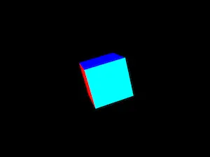
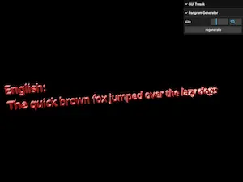
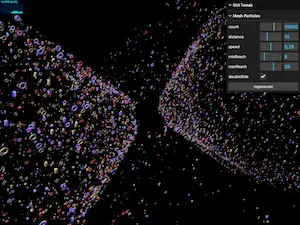
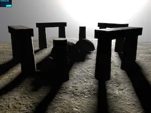
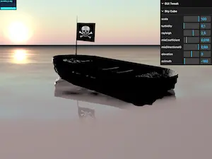
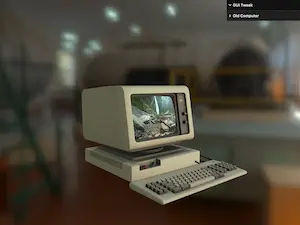
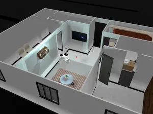
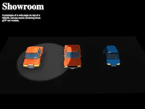

# Web3D Playground ▸ Apps

> Please note that these app links below will only work when this page is run on a web server.

## Showcases

| Name                                                                                                                                                                                                                                                                                                                    | Thumbnail                                                       |
| ----------------------------------------------------------------------------------------------------------------------------------------------------------------------------------------------------------------------------------------------------------------------------------------------------------------------- | --------------------------------------------------------------- |
| [Rotating Box](./app.html?app=0) ~ A simple 3D cube with basic color material on each side.                                                                                                                                                                                                                             |            |
| [Pangram Generator](./app.html?app=1&gui=1) ~ A text geometry rendered with MatCap (Material Capture) materials. A pangram is a sentence using every letter of a given alphabet at least once.                                                                                                                          |  |
| [Mesh Particles](./app.html?app=2&gui=1&stats=1) ~ Thousands of random geometries are rendered with random MatCap materials animated using the simple trigonometric formula.                                                                                                                                            |        |
| [Stone Monument](./app.html?app=3&stats=1) ~ An implementation of basic geometries with standard textured materials casting shadows from the rising and setting sunlight.                                                                                                                                               |        |
| [Deserted Boat](./app.html?app=4&gui=1&stats=1) ~ Another implementation of basic geometries with standard textured materials. The flag is simple vertex/fragment shaders written in GLSL. The ocean/water effect is more advanced shaders.                                                                             |          |
| [Valentine's Day](./app.html?app=5) ~ A text geometry, a heart-shaped extruded geometry, for a Valentine's Day special.                                                                                                                                                                                                 |       |
| [Old Computer](./app.html?&app=6&gui=1&emulators=1) ~ A glTF model of an old computer. It's a functioning computer, too. What can be rendered on the monitor screen?                                                                                                                                                    |            |
| [Apartment Room](./app.html?&app=8&gsap=1&rapier3d=1) ~ A tour of a simple apartment room. Demonstrates switching between Orbit and PointerLock controls. Uses the Rapier 3D physics engine for wall collision detection. PositionalAudio for spatial sound experience. Reflection on bathroom mirrors. *Desktop only*. |        |

## Pages

| Name                                                                                                                                            | Thumbnail                                             |
| ----------------------------------------------------------------------------------------------------------------------------------------------- | ----------------------------------------------------- |
| [Car Showroom](./app-CarShowroom.html?app=7&gsap=1) ~ A prototype of a web page on top of a WebGL canvas scene rendering three glTF car models. |  |

### Credits & Attributions

- [Noto: A typeface for the world](https://fonts.google.com/noto) from Google Fonts
- [MatCaps](https://github.com/nidorx/matcaps) by Alex Rodin from GitHub
- [Aerial Grass Rock](https://polyhaven.com/a/aerial_grass_rock) from Poly Haven
- [Cracked Concrete Wall](https://polyhaven.com/a/cracked_concrete_wall) from Poly Haven
- [Rough Plaster Brick](https://polyhaven.com/a/rough_plaster_brick) from Poly Haven
- [Brown Mud Leaves 01](https://polyhaven.com/a/brown_mud_leaves_01) from Poly Haven
- [Bark Willow](https://polyhaven.com/a/bark_willow) from Poly Haven
- [Pine Bark](https://polyhaven.com/a/pine_bark) from Poly Haven
- [Japanese Sycamore](https://polyhaven.com/a/japanese_sycamore) from Poly Haven
- [Flag of Jolly Roger (Pirate Flag)](https://vectorflags.com/pirates/his-pir-flag-01) from Vector Flags
- [Courgette](https://fonts.google.com/specimen/Courgette) by Karolina Lach from Google Fonts
- [Aerodynamics Workshop](https://polyhaven.com/a/aerodynamics_workshop) from Poly Haven
- [IBM 3178](https://skfb.ly/6XWzr) by maxdragonn is licensed under [Creative Commons Attribution](http://creativecommons.org/licenses/by/4.0/).
- [Lorem Picsum](https://picsum.photos/), The Lorem Ipsum for photos
- [Prince of Persia (1989)](https://dos.zone/prince-of-persia-1990/) from DOS Zone
- [Rick Rolled (Short Version)](https://www.youtube.com/watch?v=BBJa32lCaaY) from YouTube
- [Low-poly cartoon style car 01](https://skfb.ly/oxu87) | [Low-poly cartoon style car 02](https://skfb.ly/ovLQT) | [Low-poly cartoon style car 03](https://skfb.ly/owUr9) by arturs.vitas are licensed under [Creative Commons Attribution](http://creativecommons.org/licenses/by/4.0/).
- [Apartment plan](https://skfb.ly/oPnHH) by Optic_idealist is licensed under [Creative Commons Attribution](http://creativecommons.org/licenses/by/4.0/).
- [WALL-E Intro](https://www.youtube.com/watch?v=nLx_7wEmwms) from YouTube
